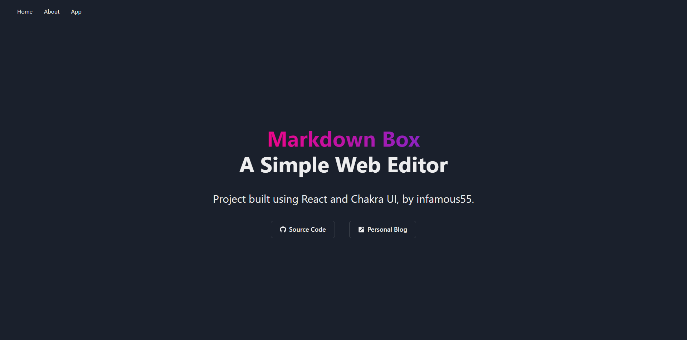
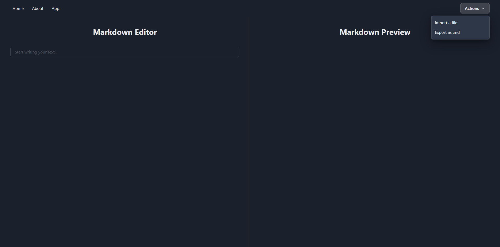

# Markdown Box



This is a simple markdown editor.

## Motivation

The project was created for learning purposes. It is hosted at [http://mdbox.herokuapp.com](http://mdbox.herokuapp.com), but file processing is disabled.

## Overview

**Markdown Box** was built using the following technologies:

- [React Context](https://reactjs.org/docs/context.html)
- [Chakra UI](https://chakra-ui.com)
- [Express](https://expressjs.com)

## Requirements

- [NodeJS](https://nodejs.org)
- [npm](https://www.npmjs.com)

## Functionality



It allows the user to import markdown files and edit
them while seeing a rendered version. The input
can be exported as a markdown file and downloaded. The application uses the local file system.

## Running locally

```bash
git clone https://github.com/infamous55/mdbox.git
cd mdbox && npm install
cd frontend && npm install && npm run build
cd .. && npm run start
```

Access at [http://localhost:5000](http://localhost:5000).
